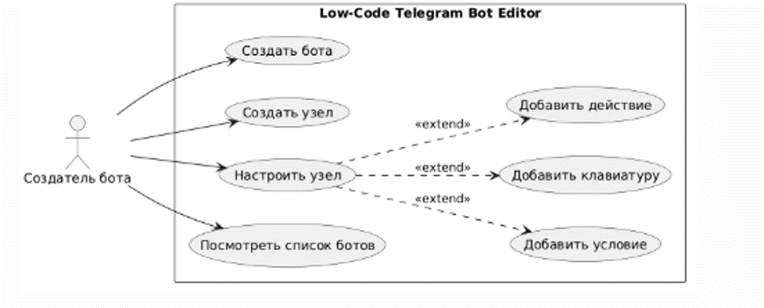
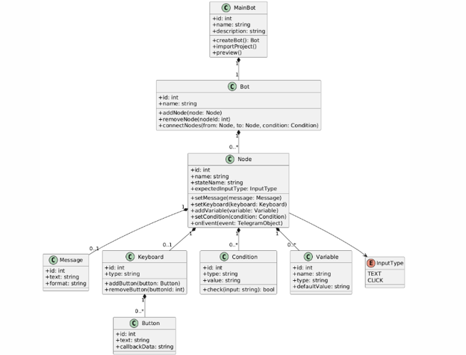
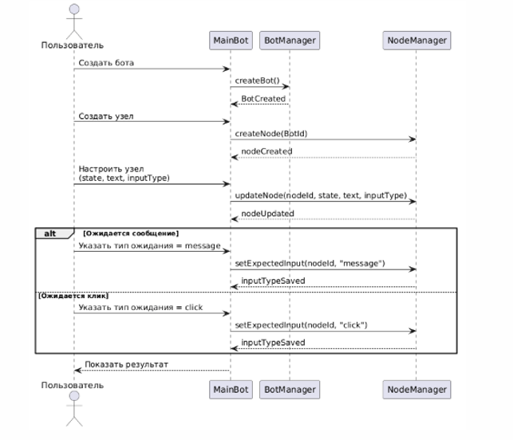
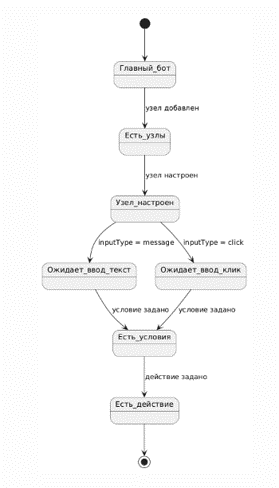
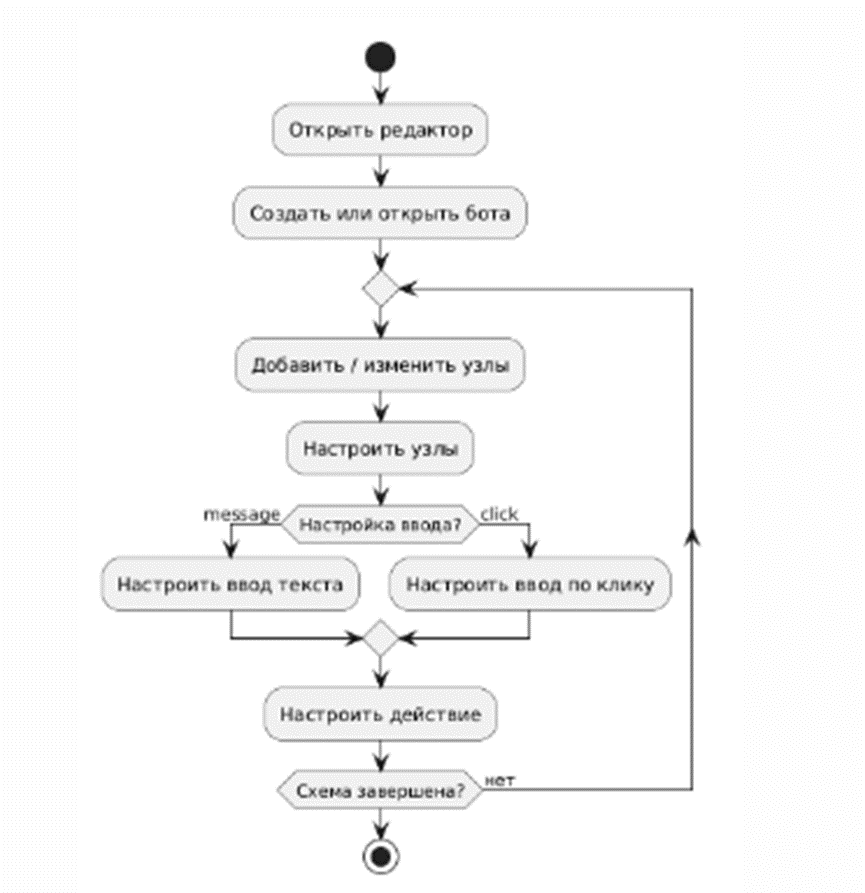
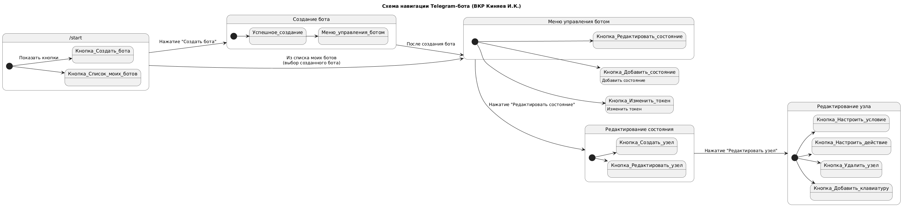

# Отчёт по созданию диаграмм для ВКР

**Выполнил:** Киняев И.К.  
**Группа:** ИВТ 2.2  
**Дисциплина:** Выпускная квалификационная работа (ВКР)

---

## Описание

В рамках подготовки ВКР был разработан комплект диаграмм, отражающих архитектуру, логику работы и структуру данных разрабатываемого программного решения. Диаграммы выполнены в соответствии с нотацией UML (Unified Modeling Language) с использованием инструмента PlantUML.

---

## Перечень диаграмм

Ниже представлены 6 основных диаграмм, созданных в процессе выполнения работы.

### Диаграмма 1
*Use Case:*  

  

---

### Диаграмма 2
*Диаграмма классов:*

  

---

### Диаграмма 3
*Диаграмма последовательностейц*

  

---

### Диаграмма 4
*Диаграмма состояний*  

  

---

### Диаграмма 5
*Диаграмма деятельностьи*

  

---

### Диаграмма 6
*Прототип интерфейса*  

 
